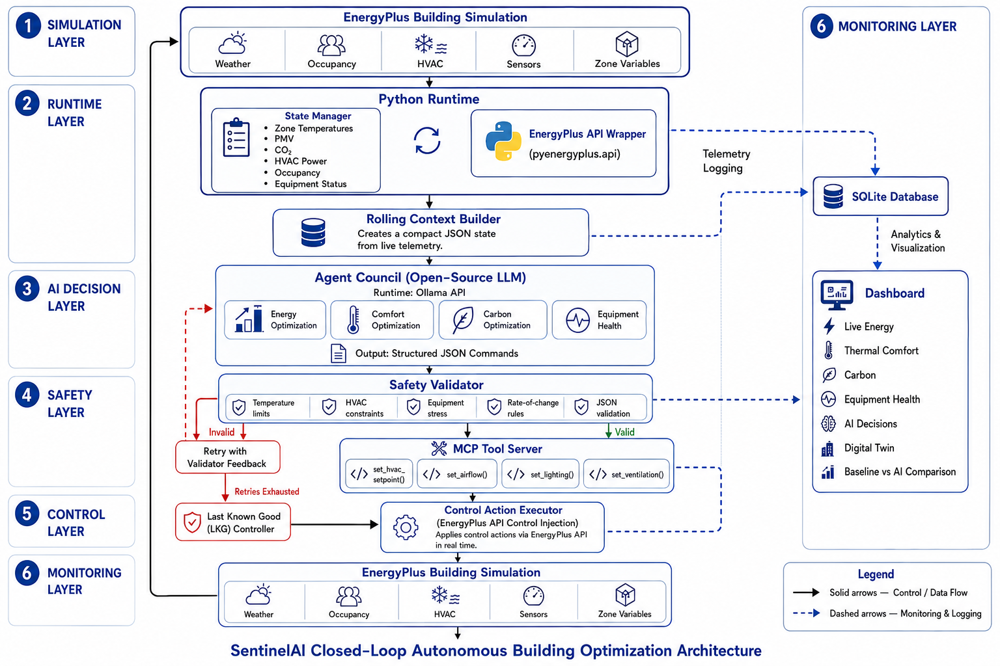

# 🏢 SentinelAI: Health-Aware Autonomous Building Intelligence Platform

> **Autonomous Building Intelligence Platform**  
> An autonomous Building Management System (BMS) integrating **EnergyPlus**, **Large Language Models (LLM)**, and the **Model Context Protocol (MCP)** with **Human-in-the-Loop (HITL)** controls to operate a closed-loop control system optimizing across **Energy**, **Comfort**, **Carbon**, and **Equipment Health**.

---

## 📦 Submission Deliverables & Proof of Concept

This project was built for the Honeywell Hackathon. **Judges can find all required deliverables directly below:**

- 🎥 **PoC Demonstration Video**: [Honeywell_Hackathon_Project_23BAI1265.mp4](./deliverables/Honeywell_Hackathon_Project_23BAI1265.mp4)
- 📊 **Presentation Slides**: [SentinelAI_BMS_Presentation.pdf](./deliverables/SentinelAI_BMS_Presentation.pdf) (also available in [PPTX format](./deliverables/SentinelAI_BMS_Presentation.pptx))
- 🏗️ **System Architecture Document**: [`ARCHITECTURE.md`](./deliverables/ARCHITECTURE.md) (also available in [DOCX format](./deliverables/ARCHITECTURE.docx))
- 🏢 **Building Models (.idf files)**:
  - [`baseline_configured.idf`](./deliverables/baseline_configured.idf) - Un-controlled static baseline building
  - [`small_office_configured.idf`](./deliverables/small_office_configured.idf) - SentinelAI dynamically controlled building
- 📦 **Submission Archive**: [23BAI1265.zip](./deliverables/23BAI1265.zip)

### 🎥 Demonstration Video
https://github.com/APEXPRE123207/Sentinel_BMS_AI/raw/main/deliverables/Honeywell_Hackathon_Project_23BAI1265.mp4
*(Note: GitHub natively supports playing .mp4 videos directly from the repository if you click the video link above. The URL above will render as a playable video when viewed on GitHub!)*

---

## 🌟 Key Architectural Innovations (v2.0)



SentinelAI transforms conventional static-schedule Building Management Systems into a self-healing, multi-objective autonomous cyber-physical platform:

- ⚡ **Single-Call Structured Agent Council**: Evaluates 4 competing objectives simultaneously (Energy, Comfort, Carbon, Equipment Health) in a single LLM prompt, returning structured JSON recommendations.
- 🤝 **Human-in-the-Loop (HITL) MCP Execution & Audit**: Integrates interactive Floating Bubble HITL approval dialogs for proposed actuation steps. Validates and executes changes via Model Context Protocol (MCP) tools and logs confirmed decisions to `mcp_audit.log`.
- 🌊 **Resilient JSON / Streaming LLM Parser**: Supports direct API connections to OpenAI-compatible endpoints, Google Gemini, Ollama Cloud, and local/custom Ollama models with automatic streaming (JSONL) aggregation and regex JSON extraction.
- 🛡️ **Modular Safety Validator & Self-Correction**: Enforces 9 hard physical, rate-limit, comfort, and equipment rules across 4 categories (`PHYSICAL`, `RATE_LIMIT`, `COMFORT`, `EQUIPMENT`). Provides structured feedback for LLM retries and falls back to **Last-Known-Good (LKG)** state if validation fails.
- 📊 **State Manager (Single Source of Truth)**: Centralized state manager that reads simulation variables, weather, occupancy, and equipment telemetry, logging atomically to SQLite.
- 📈 **Rolling Context Builder**: Summarizes a 10-step rolling window of building trends for lightweight, high-performance LLM prompting.
- 🔬 **Baseline Comparison Framework**: Dual simulation runner (`baseline.idf` vs `sentinel.idf`) providing real empirical measurement of Energy Saved (%), Carbon Reduced (%), Comfort Improvement, and Stress Reduction.
- 🔌 **Real EnergyPlus Integration**: Connects directly to `pyenergyplus.api` (EnergyPlus C-API & Python API) with zero data synthesis.
- 🏗️ **Interactive Digital Twin**: Hybrid SVG + Three.js building visualizer with room heatmaps, equipment health overlays, and click-to-inspect room telemetry.

---

## 📅 Project Phase Status

| Phase | Description | Status |
| :--- | :--- | :---: |
| **Phase 1** | **Core Control Loop & Real EnergyPlus Integration** | ✅ **Completed** |
| **Phase 2** | **Modular 9-Rule Safety Engine & LKG Serialization** | ✅ **Completed** |
| **Phase 3** | **Baseline Comparison Framework & Dual Simulation** | ✅ **Completed** |
| **Phase 4** | **Equipment Health Engine (Stress, RUL, Anomaly)** | ✅ **Completed** |
| **Phase 5** | **Live Analytics & Decision Dashboard (FastAPI + Plotly)** | ✅ **Completed** |
| **Phase 6** | **Interactive Digital Twin, Cloud LLM, Streaming & HITL MCP** | ✅ **Completed** |
| **Phase 7** | **Demo Scenario, Video & Presentation** | ✅ **Completed** |

---

## 🛠️ Environment Setup & Quickstart

### 1. Prerequisites
- **Python 3.10** (Recommended via Conda)
- **EnergyPlus** (Installed at `D:\EnergyPlus` or `C:\EnergyPlusV23-2-0`)

### 2. Conda Environment Setup
```bash
# Create and activate Conda environment
conda create -n sentinelai python=3.10 -y
conda activate sentinelai

# Install dependencies
pip install -r requirements.txt
```

---

## 🚀 Running SentinelAI

### 1. Launch FastAPI Backend & BMS Web Dashboard
```bash
python -m backend.api.main
# Open http://127.0.0.1:8000 (or http://127.0.0.1:4282) in your browser
```

### 2. Run Autonomous Closed-Loop Control (Real EnergyPlus CLI)
```bash
python -m backend.run_loop --steps 10 --energyplus
```

### 3. Run Side-by-Side Dual Simulation (Baseline vs SentinelAI)
```bash
python -m backend.building.dual_runner --steps 10
```

### 4. Run Test Suite
```bash
python -m unittest discover -s tests -p "test_*.py" -v
```

---

## 🔌 Model Context Protocol (MCP) & HITL Workflow

SentinelAI features native support for MCP tool calling:
- **Sensor Tools**: `get_zone_temperature`, `get_energy_usage`, `get_weather`, `get_equipment_status`
- **Actuation Tools**: `set_hvac_setpoint`, `set_airflow`, `set_lighting`, `set_ventilation`, `switch_pump`
- **HITL Integration**: When an actuation step is generated by the LLM / Agent Council, it presents a floating confirmation bubble in the Web Dashboard. Upon user approval, the settings are dispatched through the custom MCP tools and recorded in `mcp_audit.log`.

---

## 📁 Repository Structure

```text
Sentinel_BMS_AI/
├── backend/
│   ├── database/
│   │   ├── db.py                 # SQLite database manager & 6 log tables
│   │   └── models.py             # Dataclasses & Pydantic schemas
│   ├── state/
│   │   ├── state_manager.py      # Single source of truth for telemetry & state
│   │   └── context_builder.py    # 10-step rolling window context builder
│   ├── mcp/
│   │   └── tools.py              # MCP sensor & actuator tool definitions
│   ├── agents/
│   │   └── council.py            # Agent Council (multi-provider LLM + streaming support)
│   ├── validator/
│   │   ├── rules.py              # 9 modular safety rules across 4 categories
│   │   └── safety_validator.py   # Safety Validator + Feedback Generator + LKG Serialization
│   ├── controller/
│   │   └── forward_controller.py # Actuator command translator
│   ├── analytics/
│   │   └── comparator.py         # Empirical baseline vs AI comparison math
│   ├── energyplus/
│   │   └── runner.py             # Real pyenergyplus.api background runner & physics engine
│   ├── health_engine/
│   │   ├── engine.py             # Equipment Health Engine (stress, RUL, anomaly, alerts)
│   │   └── models.py             # Health Engine data models
│   ├── building/
│   │   ├── small_office.idf      # Primary EnergyPlus building model
│   │   ├── baseline.idf          # Baseline building model (static schedule)
│   │   ├── sentinel.idf          # SentinelAI building model (dynamic actuation)
│   │   ├── weather.epw           # Weather file
│   │   ├── baseline_runner.py    # Baseline EnergyPlus runner
│   │   └── dual_runner.py        # Side-by-side Dual Simulation runner
│   ├── api/
│   │   └── main.py               # FastAPI REST API & dashboard server (HITL & MCP endpoints)
│   ├── dashboard/
│   │   ├── index.html            # BMS Web Control Dashboard with HITL Floating Bubble
│   │   └── static/
│   │       ├── app.js            # Dashboard logic, Plotly.js charts, and digital twin
│   │       └── styles.css        # Premium dark design system
│   └── run_loop.py               # Autonomous closed-loop orchestrator
├── deliverables/                 # Presentation, Docs, and Video for Submission
├── tests/
│   ├── test_closed_loop.py       # Integration tests
│   ├── test_safety_rules.py      # 33 safety rule tests
│   ├── test_baseline_comparison.py # Baseline comparison tests
│   └── test_dashboard_api.py     # Dashboard API endpoint tests
├── .env                          # API keys (gitignored)
├── PHASES.md                     # Master project roadmap & context reference
├── Project_plan.md               # Original project blueprint & v2.0 specs
├── requirements.txt              # Project dependencies
└── README.md                     # Documentation
```

---

## 📄 License
This project is licensed under the MIT License - see the LICENSE file for details.
